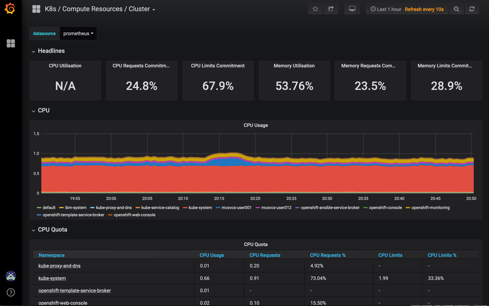

# IBM Client Developer Advocacy App Modernization Series

## Essential logging and monitoring with OpenShift

The Kubernetes container management platform available on OpenShift provides the ability to run large numbers of workloads for applications in a cluster environment. Running applications on a cluster introduces new concerns, and the practice of using a microservices architecture increases the number of moving parts.

In this lab, you will get an overview of the capabilities available to view logs and kubernetes events from the OpenShift web UI. This lab will also demonstrate the OpenShift cluster-based monitoring features with Prometheus and Grafana.

The screenshots and examples from this lab will be based on a deployment of the [StockTrader Lite](https://github.com/IBMStockTraderLite) application. You can find step-by-step instructions to install the application in the [microservices on OpenShift](https://github.com/IBMAppModernization/app-modernization-microservices-lab-openshift) lab.

## Part 1. Understanding Logging

Applications running on Kubernetes run in containers created inside pods. One or more pods from a deployment may be operational at a given time and each pod's log stream is unique. When there are more than one container within a pod the logs for all containers, or just a specific container can be displayed.

### Using the CLI

Open your cloud shell and copy the `oc` login command from the web console if the current session has expired. Hint, you can check the login session by running the `oc namespaces` command.

Set the current project to the one where you have the StockTrader Lite application. Replace the NNN in the example below with your user number (e.g. user012)

```text
oc project mcsvcs-userNNN
```

List the pods in the project

```text
oc get pods
NAME                             READY     STATUS    RESTARTS   AGE
event-streams-consumer-1-4bgxs   1/1       Running   0          7h
mariadb-1-r2hbz                  1/1       Running   0          9h
mongodb-1-xgbqr                  1/1       Running   0          9h
portfolio-1-2rlwd                1/1       Running   0          7h
stockquote-1-4ld88               1/1       Running   0          7h
trade-history-1-f9h5w            1/1       Running   0          7h
tradr-1-fctgl  
```

View the logs for some of the microservice pods using the `oc logs <podname>` command. Replace the actual name of your *event_streams_consumer* in the example below.

```text
oc logs event-streams-consumer-1-4bgxs
exec java -Xmx75m -XX:TieredStopAtLevel=1 -XX:ParallelGCThreads=1 -XX:ConcGCThreads=1 -Djava.util.concurrent.ForkJoinPool.common.parallelism=1 -XX:CICompilerCount=1 -XX:+UseParallelGC -XX:GCTimeRatio=4 -XX:AdaptiveSizePolicyWeight=90 -XX:MinHeapFreeRatio=20 -XX:MaxHeapFreeRatio=40 -XX:+ExitOnOutOfMemoryError -cp . -jar /deployments/event-streams-consumer-1.0-SNAPSHOT.jar
Nov 10, 2019 6:24:29 PM com.ibm.hybrid.cloud.sample.stocktrader.eventstreamsconsumer.EventStreamsConsumer main
INFO: EventStreamsConsumer starting ...
...
Nov 10, 2019 7:55:46 PM com.ibm.hybrid.cloud.sample.stocktrader.eventstreamsconsumer.EventStreamsConsumer lambda$runConsumer$0
INFO: Consumer Record:(stocktrader-user001, {"id": "cb546856-ea76-4b65-b1a2-c7471e86c439", "owner": "Client2", "symbol": "T", "shares": 10, "price": 39.38, "when": "2019-11-10 07:55:45.439", "commission": 9.99}, 0, 33)

Nov 10, 2019 7:55:46 PM com.ibm.hybrid.cloud.sample.stocktrader.eventstreamsconsumer.EventStreamsConsumer insertStockPurchase
INFO: In Mongo Connector insertStockPurchase
Nov 10, 2019 7:55:46 PM com.ibm.hybrid.cloud.sample.stocktrader.eventstreamsconsumer.EventStreamsConsumer lambda$runConsumer$0
INFO: Returned from call to Mongo
```

Explore the log output from other pods. Notice that the log structure is simply the native format that is being written to standard out by the application and may or may not include an actual timestamp for the log event.

```text
oc logs stockquote-1-4ld88 | tail -10
GET /stock-quote/about 200 0.219 ms - 8
GET /stock-quote/about 200 0.202 ms - 8
GET /stock-quote/about 200 0.198 ms - 8
GET /stock-quote/about 200 0.212 ms - 8
GET /stock-quote/about 200 0.218 ms - 8
GET /stock-quote/about 200 0.230 ms - 8
GET /stock-quote/about 200 0.221 ms - 8
GET /stock-quote/about 200 0.214 ms - 8
GET /stock-quote/about 200 0.228 ms - 8
GET /stock-quote/about 200 0.201 ms - 8
```

You can use standard shell filtering tools as well to find specific records of interest in the logs. In the example below, replace "IBM" with another one of the stocks that you bought or sold in the StockTrader Lite application.

```text
oc logs stockquote-1-4ld88 | grep IBM
Getting quote for stock IBM ...
Calling API Connect with URL https://api.us-south.apiconnect.appdomain.cloud/ww-client-advocacy-workshop-dev/sb/stocks/IBM
{"symbol":"IBM","date":"2019-11-08","time":1573246850446,"price":137.61}
GET /stock-quote/IBM 200 381.162 ms - 72
Getting quote for stock IBM ...
Calling API Connect with URL https://api.us-south.apiconnect.appdomain.cloud/ww-client-advocacy-workshop-dev/sb/stocks/IBM
{"symbol":"IBM","date":"2019-11-08","time":1573246850446,"price":137.61}
GET /stock-quote/IBM 200 634.835 ms - 72
Getting quote for stock IBM ...
Calling API Connect with URL https://api.us-south.apiconnect.appdomain.cloud/ww-client-advocacy-workshop-dev/sb/stocks/IBM
{"symbol":"IBM","date":"2019-11-08","time":1573246850446,"price":137.61}
```

### Using the OpenShift Application Console

To get to the logs for a particular application in OpenShift, you can navigate either through the deployment or the pod. Open the OpenShift web console and select your project with the StockTrader Lite application

Select the event streams consumer deployment by clicking on the name of the deployment


Click on **View log**, this will open up a scrollable window of the log events from the pod running in the deployment. Click on the **Go to Top** button in the lower right to navigate to the top of the log.


From this panel you can expand into a full browser screen or download the log file contents to the local system.

When you are finished examining this log, click on **Overview** on the left menu to return to the list of deployed resources in the project.

To navigate to the view of the logs from the deployed pod, click on one of the **pod** labels to the right side of any deployment


The *Details* view for the pod will be displayed. Each pod in a deployment will have it's own *Details* page. You can click on the **Logs** tab to open up the view of the pod's logs.


Note that you can also click on the **Terminal** tab and this will open up a shell on the container in the pod. This is identical to using the `oc exec -it <podname> sh` command.

Explore the logs (and terminals) of the other pods to get a feel for what is going on in the application components. You can also go back to the `tradr` application and perform a few more buy/sell transactions to observe log information from the application components.

## Part 2. OpenShift Cluster Monitoring

OpenShift includes a configured monitoring system using Prometheus and Grafana that can be customized by operators, but generally supports a significant set of concerns of monitoring overall cluster health and generating alerts in the case of problems. It's not in the scope of this introductory lab to cover delivery of external alerts, but configuring external alerts is simply configuring the endpoint for your alert provider integration (e.g. pagerduty, slack, etc...)

From the OpenShift Web Console, select the **Cluster Console** from the pulldown.


### Prometheus

On the left side, expand **Monitoring** and click on **Metrics**. If you are prompted to log in, select the log in with OpenShift button, and then grant the permissions requested. This will display the Prometheus dashboard.

In the query window enter the following to get a list of cpu utilization of the pods in your project (update NNN with your user number), and then click on the **Execute** button.

```text
pod_name:container_cpu_usage:sum{namespace="mcsvcs-userNNN"}
```


This is a current view of the latest value of the time series stored by prometheus. These values are actually estimates of the 5 minute load average from the container on the worker node. You can click on the **Graph** tab to see a chart of the recent trends in CPU usage

Update the query to only show pods where the metric is above a (relatively) low level.

```text
pod_name:container_cpu_usage:sum{namespace="mcsvcs-userNNN"} > 0.05
```

Click on the **Execute** button again. Probably all of the pods will disappear. It's time to generate some load. Switch to a browser tab with the cloud shell and run these commands. **Note** update "Client2" if you used a different name when testing the StockTrader Lite application.

```text
export TRADE_HISTORY_URL=$(oc get route trade-history | awk '/trade.*/ {print $2 $3 "/Client2"}')
while sleep 0.5; do curl -s $TRADE_HISTORY_URL ; done
```

This will start an ongoing series of requests (2 per second) to the *trade-history* microservice. Wait a minute or two and repeat the **Execute**.


In the top menu for Promentheus, select the **Alerts** pulldown. This is the set of alerting rules that Prometheus is currently monitoring. We expect the **DeadMansSwitch** to be firing because this is a special alert designed to confirm that the alerting system is operational. There are anecdotal cases of on-call engineers receiving "everything is ok" alerts every 5 minutes. Now there are modern services like [Dead Man's Snitch](https://deadmanssnitch.com/) that will accept these message and notify support personnell if they are **not** received.

### Grafana

Go back to the tab with the OpenShift Cluster Console. On the left side in the **Monitoring** section is a **Dashboards** link. Open the **Dashboards** link to open Grafana. You may see a default page or the Home page.


Select the **K8s / Compute Resources / Cluster** dashboard to get the big picture view for your cluster.



Explore some other dashboards by clicking on the graphic on the upper left side. Finish up with the **K8s / Compute Resources / Namespace** dashboard. Select from the pulldown the dashboard for your StockTrader App.


It's easy to see here that the trade-history component is much more active than all of the other pods. Go back to the cloud shell and enter Ctrl-C in the terminal to stop the simulated load. This grafana dashboard is using a metric calculated by Prometheus using this rule:

```text
record: pod_name:container_cpu_usage:sum
expr: sum
  by(pod_name, namespace) (rate(container_cpu_usage_seconds_total{container_name!="",container_name!="POD",pod_name!=""}[5m]))
```

Since the figure reflects the 5 minute load average, it will take just a little while after you have stopped the loop of curl requests to the trade-history service.

If you wait a few minutes and check grafana again it will look like:


## Summary

In this lab you have explored access to log output from applications using Kubernetes / OpenShift CLI tooling and also the web browser UI for OpenShift. After that you set up a custom query in Prometheus and observed CPU utilization changes caused by a simulated load on an application component. Then, you saw how to use Grafana and a set of included dashboards to be able to monitor the state of an OpenShift cluster.
